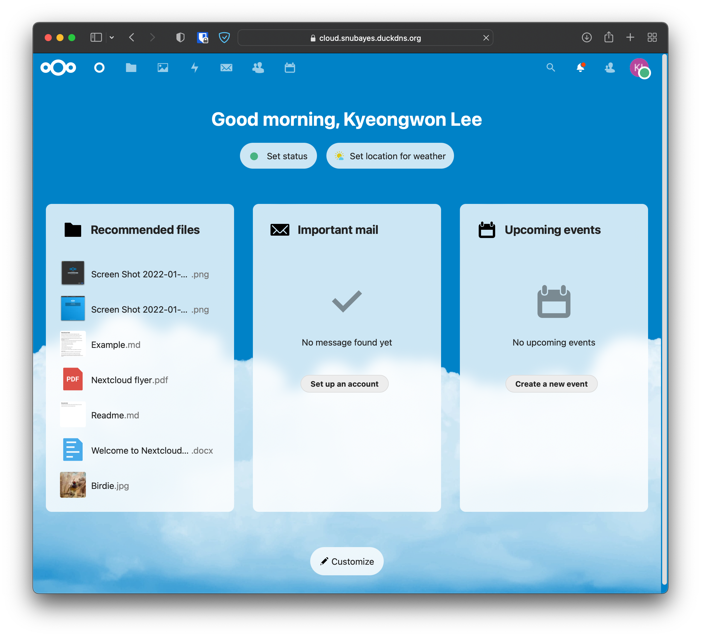
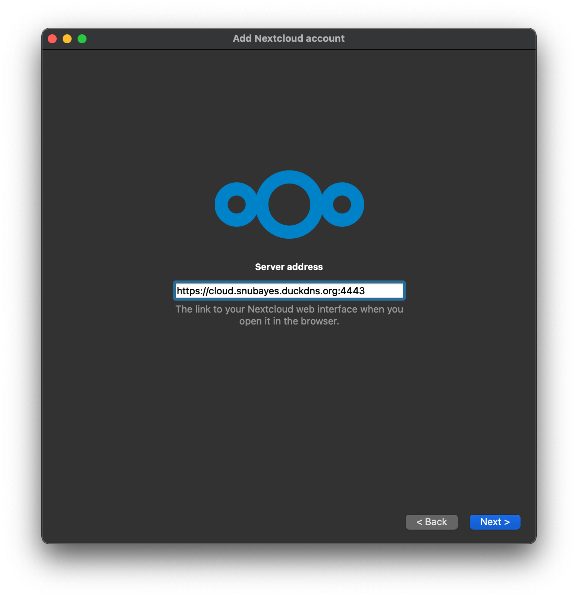
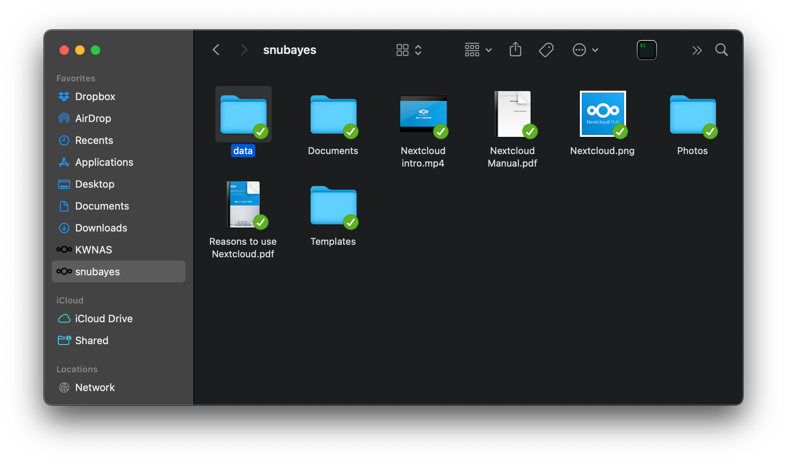

# NextCloud

연구실 서버에 설치되어있는 클라우드. 서버와 개인 컴퓨터를 동기화할 때 사용할 수 있다.

> https://cloud.snubayes.duckdns.org:4443

> (중요) 사용자의 홈 폴더 내 data 디렉토리는 nextcloud의 data 디렉토리와 연동된다. 

1. 서버 관리자에게 계정 생성 요청
	1. (서버 관리자) 계정 생성
	2. (사용자) nextcloud 로그인 확인
	3. (관리자) 사용자의 홈 폴더 내 data 디렉토리를 마운트[^note]
2. https://nextcloud.com/clients/ 에 접속해서 클라이언트 설치
3. NextCloud 연동 
   
   
4. 동기화 확인 및 사용 

[^note]: 이후 사용자의 홈 폴더 내 data 디렉토리는 nextcloud의 data 디렉토리와 연동된다. 