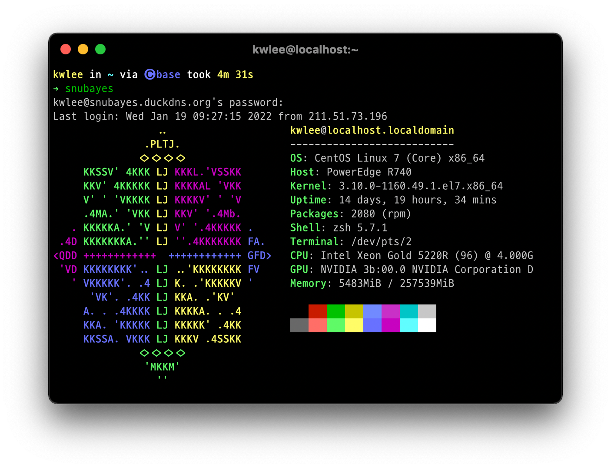

---
tags:
  - server
  - manual
---

# 연구실 서버 사용 메뉴얼

* 관리자: 전산 담당자

## 1 재원

```
OS: CentOS Linux 7 (Core) x86_64
Host: PowerEdge R740
Kernel: 3.10.0-1160.49.1.el7.x86_64
CPU: Intel Xeon Gold 5220R *2 (96) @ 4.000GHz
GPU: NVIDIA RTX 3090 *1 24GB
Memory: 257539MiB
```

## 2 접속

### 2.1 도메인

연구실 서버를 사용하기 위해서는 당연히 계정이 필요한데, 관리자에게 부탁하여 계정을 생성하자. 연구실 서버의 IP 주소는 `147.46.xx.xx`이며 `xxxx`번 포트를 이용하여 접속 가능하다.

### 2.2 SSH

> 관련 설명은 [[ssh]] 참고



## 3 프로그램 

### 3.1 설치된 프로그램

* [[rstudio]]
* [[jupyter]]
* [[nextcloud]]
* [[snapdrop]]

### 3.2 설치를 원하는 프로그램

* 기본적으로 프로그램의 설치는 관리자에게 권한이 주어져있다. 
* 다른 프로그램의 설치를 원한다면 다음의 방법을 사용하자.
	1. 관리자에게 문의
	2. conda 등 가상환경에 설치 후 PATH 지정

[//begin]: # "Autogenerated link references for markdown compatibility"
[ssh]: ../../statgpu/linux/ssh.md "서버 접속: SSH"
[rstudio]: rstudio.md "Rstudio Server"
[jupyter]: jupyter.md "JupyterHub"
[nextcloud]: nextcloud.md "NextCloud"
[snapdrop]: snapdrop.md "Snapdrop"
[//end]: # "Autogenerated link references"