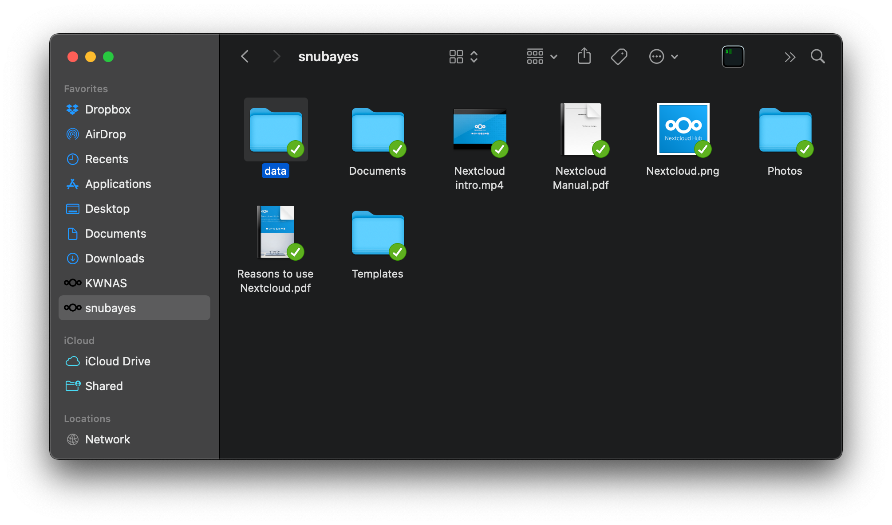

---
tags:
  - server
  - manual
---

# 연구실 서버 사용 메뉴얼

* 관리자: 전산 담당자

## 1 재원

```
OS: CentOS Linux 7 (Core) x86_64
Host: PowerEdge R740
Kernel: 3.10.0-1160.49.1.el7.x86_64
CPU: Intel Xeon Gold 5220R *2 (96) @ 4.000GHz
GPU: NVIDIA RTX 3090 *1 24GB
Memory: 257539MiB
```

## 2 접속

### 2.1 도메인

연구실 서버를 사용하기 위해서는 당연히 계정이 필요한데, 관리자에게 부탁하여 계정을 생성하자. 연구실 서버의 IP 주소는 `147.46.xx.xx`이며 `xxxx`번 포트를 이용하여 접속 가능하다.

### 2.2 SSH

> 관련 설명은 [[ssh]] 참고


## 3 프로그램 

### 3.1 Rstudio Server 

연구실 서버로 Rstudio를 실행할 수 있는 환경, 기본적으로 패키지는 사용자의 홈폴더에 생성된다. 자세한 사용방법은 Rstudio 메뉴얼을 참고

> (중요) 사용자의 홈 폴더 내 data 디렉토리는 nextcloud의 data 디렉토리와 연동된다. 

> https://rstudio.snubayes.duckdns.org:4443


### 3.2 jupyter hub

연구실 서버로 Jupyter notebook을 실행할 수 있는 환경. 사용을 권장하지는 않으며 홈폴더에 conda설치 후 개별적으로 jupyter notebook + ssh 터널링을 사용할 것을 권장

> https://jupyter.snubayes.duckdns.org:4443


### 3.3 NextCloud

연구실 서버에 설치되어있는 클라우드. 사용자의 홈폴더 내 nextcloud 폴더와 개인 컴퓨터 간의 파일을 동기화할 때 사용할 수 있다.

> https://cloud.snubayes.duckdns.org:4443


1. 서버 관리자에게 계정 생성 요청
	1. (서버 관리자) 계정 생성
	2. (사용자) nextcloud 로그인 확인
	3. (서버 관리자) data 디렉토리 FTP mount
2. https://nextcloud.com/clients/ 에 접속해서 클라이언트 설치
3. NextCloud 연동 
   
   
4. 동기화 확인 및 사용 

### 3.4 다른 프로그램의 설치

* 기본적으로 프로그램의 설치는 관리자에게 권한이 주어져있다. 
* 다른 프로그램의 설치를 원한다면 다음의 방법을 사용하자.
	1. 관리자에게 문의
	2. conda 등 가상환경에 설치 후 PATH 지정

[//begin]: # "Autogenerated link references for markdown compatibility"
[ssh]: ../../statgpu/linux/ssh.md "서버 접속: SSH"
[//end]: # "Autogenerated link references"