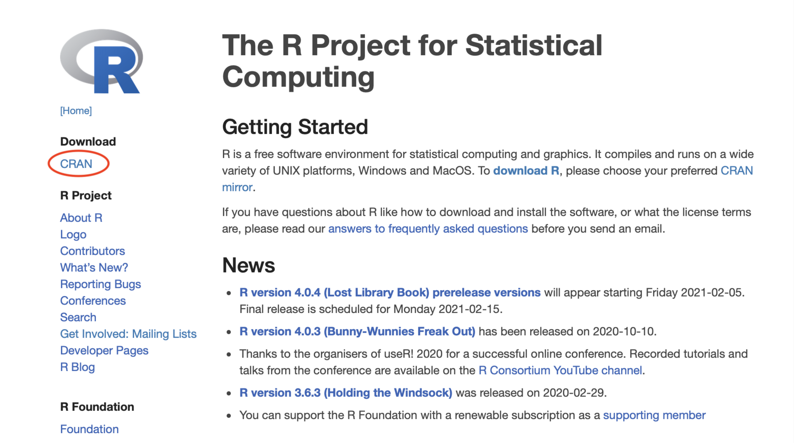
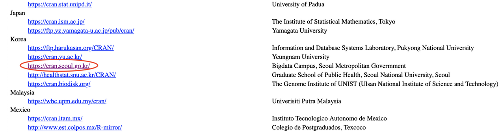
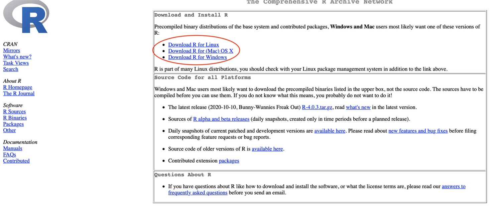
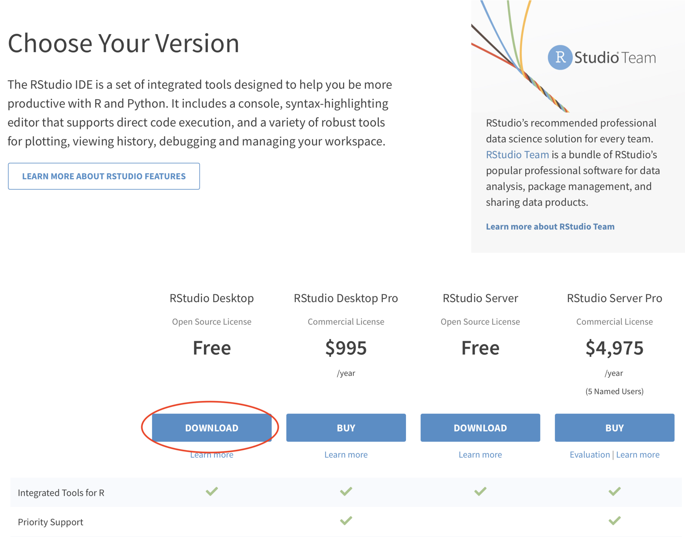
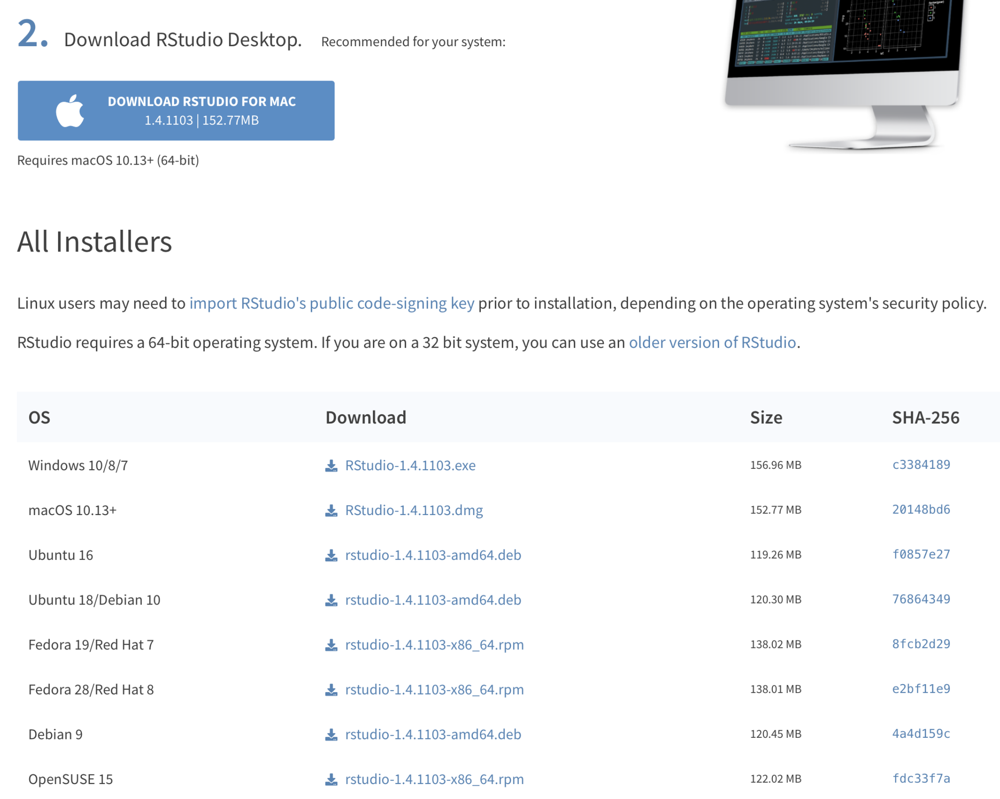

---
tags:
  - manual
  - installation
---

# R, RStudio 및 RStan 설치 가이드

마지막 업데이트 : 2024.07.23 (오정훈)

작성자: 박수원

기여자: 이재귀, 김성민, 박수원, 오정훈

공개강좌를 위한 R, RStudio 및 RStan 설치 가이드 문서입니다.[^1]

[^1]: 본 문서는 이재귀 학생과 김성민 학생의 'rstan 설치방법.pdf'를
    참조하여 작성된 설치 가이드입니다.

R, RStudio 및 RStan의 정책에 따라 설치 과정이 바뀌었을 수도 있으니 
막히는 부분이 있으면 먼저 검색을 통해 문제를 해결해 보신 후에 문의 부탁드립니다.

## 1. R 설치

[R 웹사이트](https://www.r-project.org)에 접속하여 Download - CRAN을 선택합니다.



다운로드 속도를 위해 자신의 물리적 위치와 가급적 가까운 곳의 CRAN을 선택합니다.



컴퓨터의 운영체제(OS)에 맞는 R을 설치합니다.



## 2. RStudio 설치

[Rstudio 웹사이트](https://rstudio.com/products/rstudio/download)에 접속하여 RStudio Desktop 항목 하단의 DOWNLOAD를 클릭합니다.



컴퓨터의 운영체제(OS)에 맞는 RStudio를 설치합니다.



## 3. RStan 설치

RStudio을 열고 새로운 R Script 파일에 아래의 코드를 작성하여 실행시켜 줍니다.

```r
if (file.exists(".RData")) file.remove(".RData")
remove.packages("rstan")
install.packages("rstan", repos = "https://cloud.r-project.org/", dependencies = TRUE)
```

- Apple M1칩 이상의 CPU가 탑재된 MacOS 컴퓨터
- R 버전이 4.2 이상인 Windows 컴퓨터

의 경우 위의 코드 대신 아래의 코드를 실행시켜 줍니다.

```r
if (file.exists(".RData")) file.remove(".RData")
remove.packages("StanHeaders")
remove.packages("rstan")
install.packages("StanHeaders", repos = c("https://mc-stan.org/r-packages/", getOption("repos")))
install.packages("rstan", repos = c("https://mc-stan.org/r-packages/", getOption("repos")))
```

- [RStan 한국어 깃헙 위키](https://github.com/stan-dev/rstan/wiki/RStan-Getting-Started-(%ED%95%9C%EA%B5%AD%EC%96%B4))에 가보시면 RStan 설치에 대한 상세한 설명을 보실 수 있습니다. 
- 최신화된 가이드는 영문으로 [Rstan Getting Started](https://github.com/stan-dev/rstan/wiki/RStan-Getting-Started)에서 확인하실 수 있습니다.

## 4. stanmodel object 컴파일 설정

RStan 설치가 완료되었으면 아래의 코드를 실행시켜 줍니다.

```r
pkgbuild::has_build_tools(debug = TRUE)

dotR <- file.path(Sys.getenv("HOME"), ".R")
if (!file.exists(dotR)) dir.create(dotR)
M <- file.path(dotR, "Makevars")
if (!file.exists(M)) file.create(M)

if(grepl("^windows", R.version$os) | grepl("^mingw", R.version$os)){
  cat("\nCXX14FLAGS += -mtune=native -O3 -mmmx -msse -msse2 -msse3 -mssse3 -msse4.1 -msse4.2",
      "\nCXX11FLAGS += -mtune=native -O3 -mmmx -msse -msse2 -msse3 -mssse3 -msse4.1 -msse4.2",
      file = M, sep = "\n", append = FALSE)
}else if(grepl("^darwin", R.version$os)){
  arch <- ifelse(R.version$arch == "aarch64", "arm64", "x86_64")
  cat(paste("\nCXX14FLAGS += -O3 -mtune=native -arch", arch, "-ftemplate-depth-256"),
    file = M, sep = "\n", append = FALSE)
}else if(grepl("^linux", R.version$os)){
  cat("\nCXX14FLAGS += -mtune=native -fPIC -O3 -mmmx -msse -msse2 -msse3 -mssse3 -msse4.1 -msse4.2",
      "CXX14=g++", # or clang++ but you may need a version postfix
      file = M, sep = "\n", append = FALSE)
}else{
  print(paste("Unknown OS :", R.version$os))
}
```

## 5. RStan 작동 검증

RStan이 잘 실행되는지 확인하기 위해 아래의 코드를 실행시켜 봅니다.

```r
library(rstan)
schools = 
  data.frame(y = c(28., 8., -3., 7., -1., 1., 18., 12.), 
             s =c(15., 10., 16., 11., 9., 11., 10., 18.), 
             index=c("A","B","C","D","E","F","G", "H") )

eightschools_indep = "
data {
  int<lower=0> J;         // number of schools 
  real y[J];              // estimated treatment effects
  real<lower=0> sigma[J]; // standard error of effect estimates 
}
parameters {
  vector[J] theta;          // unscaled deviation from mu by school
}
model {
  target += normal_lpdf(y | theta, sigma); // log-likelihood
}
"

data = list(J = dim(schools)[1], y=schools$y, sigma = schools$s)

fit.indep = 
  stan(model_code=eightschools_indep, data=data, 
       seed=1234567, chains=1, iter=2000, thin=10, algorithm="NUTS")
```

## 6. 에러 발생 시

<a href="#5-rstan-작동-검증">5. RStan 작동 검증</a>단계에서 문제가 발생하면
아래의 코드를 실행해 Makevars 파일을 열어줍니다.

```r
if(grepl("^linux", R.version$os)){
  file.edit(file.path(Sys.getenv("HOME"), ".R", "Makevars"))
}else if(grepl("^windows", R.version$os)){
  file.edit("~/.R/Makevars.win"))
}else if(grepl("^darwin", R.version$os)){
  file.edit(file.path(Sys.getenv("HOME"), ".R", "Makevars"))
}else{
  print(paste("Unknown OS :", R.version$os))
}
```

만약 Makevars 파일에 '-march=native'라고 쓰인 부분이 있다면 모두 삭제한 후 Makevars 파일을 저장합니다.

그 후, 위에서 했던 <a href="#4-stanmodel-object-컴파일-설정">4. stanmodel object 컴파일 설정</a>과 <a href="#5-rstan-작동-검증">5. RStan 작동 검증</a>을 다시 실행해봅니다.

### 6.1 윈도우 RTools, RBuildTools 에러

윈도우 운영체제의 경우 다음과 같이 에러문에 RTools 및 RBuildTools 관련 에러가 발생할 수 있습니다.

유형 1.

```r
Error in compileCode(f, code, language = language, verbose = verbose) :
  C:\RBuildTools\...(중략)...
  Error in sink(type = "output") : invalid connection
```

유형 2.

```r
Error in compileCode(f, code, language = language, verbose = verbose) :
  C:\rtools42\...(중략)...
  Error in sink(type = "output") : invalid connection
```

위에서 `C:\rtools42` 부분은 RTools 버전에 따라 다를 수 있습니다. 가령 RTools40의 경우 에러문은 다음과 같습니다.

```r
Error in compileCode(f, code, language = language, verbose = verbose) :
  C:\rtools40\...(중략)...
  Error in sink(type = "output") : invalid connection
```

이럴 경우 다음의 절차를 밟아보십시오.

1. R 버전을 4.2 혹은 4.3+로 업데이트 합니다.

2. 사전에 `rstan`이 설치가 되어있다면 RStudio에서 다음의 명령문으로 `rstan`과 `StanHeaders`를 삭제합니다.

```r
remove.packages("rstan")
remove.packages("StanHeaders")
```

3. `C:\BuildTools` 와 `C:\rtools(숫자)` 폴더를 삭제 후 아래 링크에서 나의 R 버전에 맞는 RTools 를 설치합니다.
    - R version 4.2 : [RTools42](https://cran.r-project.org/bin/windows/Rtools/rtools42/rtools.html) 설치
    - R version 4.3+ : [Rtools43](https://cran.r-project.org/bin/windows/Rtools/rtools43/rtools.html) 설치


1. RStudio 세션을 재실행 하거나 PC를 재실행합니다.

2. 다음 명령문으로 `rstan`, `StanHeaders`의 최신 Release 버전을 설치합니다.

```r
install.packages("StanHeaders", repos = c("https://mc-stan.org/r-packages/", getOption("repos")))
install.packages("rstan", repos = c("https://mc-stan.org/r-packages/", getOption("repos")))
```

6. 위에서 했던 <a href="#4-stanmodel-object-컴파일-설정">4. stanmodel object 컴파일 설정</a>과 <a href="#5-rstan-작동-검증">5. RStan 작동 검증</a>을 다시 실행해봅니다.
