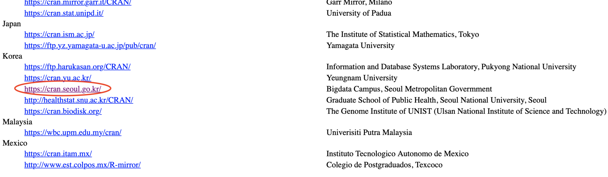
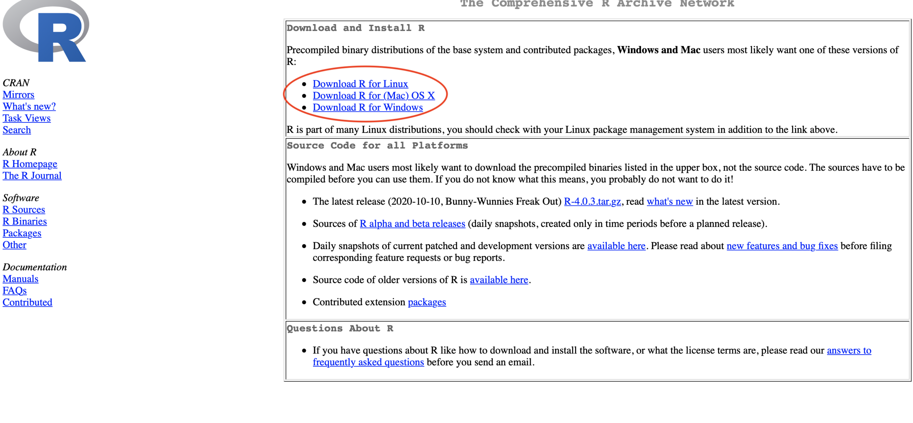

---
tags:
  - manual
  - installation
---

# R, RStudio 및 RStan 설치 가이드

마지막 업데이트 : 2022.08.05

공개강좌를 위한 R, RStudio 및 RStan 설치 가이드 문서입니다.[^1]

[^1]: 이 장의 많은 부분은 이재귀 학우와 김성민 학우가 기여한 'rstan 설치방법.pdf'를
    참조하여 작성되었습니다.

R, RStudio 및 RStan의 정책에 따라 설치 과정이 바뀌었을 수도 있으니 
막히는 부분이 있으면 먼저 검색을 통해 문제를 해결해 보신 후에 문의 부탁드립니다.

## 1. R 설치

[R 웹사이트](https://www.r-project.org)에 접속하여 Download - CRAN을 선택합니다.


다운로드 속도를 위해 자신의 물리적 위치와 가급적 가까운 곳의 CRAN을 선택합니다.



컴퓨터의 운영체제(OS)에 맞는 R을 설치합니다.



## 2. RStudio 설치

[Rstudio 웹사이트](https://rstudio.com/products/rstudio/download)에 접속하여 RStudio Desktop 항목 하단의 DOWNLOAD를 클릭합니다.


컴퓨터의 운영체제(OS)에 맞는 RStudio를 설치합니다.


## 3. RStan 설치

RStudio을 열고 새로운 R Script 파일에 아래의 코드를 작성하여 실행시켜 줍니다.

```r
remove.packages("rstan")
if (file.exists(".RData")) file.remove(".RData")
install.packages("rstan", repos = "https://cloud.r-project.org/", dependencies = TRUE)
```

Apple M1칩 이상의 CPU가 탑재된 MacOS 컴퓨터는 위의 코드 대신 아래의 코드를 실행시켜 줍니다.

```r
remove.packages("rstan")
if (file.exists(".RData")) file.remove(".RData")
install.packages("rstan", repos = c("https://mc-stan.org/r-packages/", getOption("repos")))
```

[RStan 한국어 깃헙 위키](https://github.com/stan-dev/rstan/wiki/RStan-Getting-Started-(%ED%95%9C%EA%B5%AD%EC%96%B4))에 가보시면 RStan 설치에 대한 상세한 설명을 보실 수 있습니다. 

## 4. stanmodel object 컴파일 설정

RStan 설치가 완료되었으면 아래의 코드를 실행시켜 줍니다.

```r
pkgbuild::has_build_tools(debug = TRUE)

dotR <- file.path(Sys.getenv("HOME"), ".R")
if (!file.exists(dotR)) dir.create(dotR)
M <- file.path(dotR, "Makevars")
if (!file.exists(M)) file.create(M)

if(grepl("^windows", R.version$os)){
  cat("\nCXX14FLAGS += -mtune=native -O3 -mmmx -msse -msse2 -msse3 -mssse3 -msse4.1 -msse4.2",
      "\nCXX11FLAGS += -mtune=native -O3 -mmmx -msse -msse2 -msse3 -mssse3 -msse4.1 -msse4.2",
      file = M, sep = "\n", append = FALSE)
}else if(grepl("^darwin", R.version$os)){
  arch <- ifelse(R.version$arch == "aarch64", "arm64", "x86_64")
  cat(paste("\nCXX14FLAGS += -O3 -mtune=native -arch", arch, "-ftemplate-depth-256"),
    file = M, sep = "\n", append = FALSE)
}else if(grepl("^linux", R.version$os)){
  cat("\nCXX14FLAGS += -mtune=native -fPIC -O3 -mmmx -msse -msse2 -msse3 -mssse3 -msse4.1 -msse4.2",
      "CXX14=g++", # or clang++ but you may need a version postfix
      file = M, sep = "\n", append = FALSE)
}else{
  print(paste("Unknown OS :", R.version$os))
}
```

## 5. RStan 작동 검증

RStan이 잘 실행되는지 확인하기 위해 아래의 코드를 실행시켜 봅니다.

```r
library(rstan)
schools = 
  data.frame(y = c(28., 8., -3., 7., -1., 1., 18., 12.), 
             s =c(15., 10., 16., 11., 9., 11., 10., 18.), 
             index=c("A","B","C","D","E","F","G", "H") )

eightschools_indep = "
data {
  int<lower=0> J;         // number of schools 
  real y[J];              // estimated treatment effects
  real<lower=0> sigma[J]; // standard error of effect estimates 
}
parameters {
  vector[J] theta;          // unscaled deviation from mu by school
}
model {
  target += normal_lpdf(y | theta, sigma); // log-likelihood
}
"

data = list(J = dim(schools)[1], y=schools$y, sigma = schools$s)

fit.indep = 
  stan(model_code=eightschools_indep, data=data, 
       seed=1234567, chains=1, iter=2000, thin=10, algorithm="NUTS")
```

## 6. 에러 발생 시

[5. RStan 작동 검증](https://snubayes.github.io/wiki/docs/lab/open-course/rstudio_rstan_installation_guide/#5-rstan-%EC%9E%91%EB%8F%99-%EA%B2%80%EC%A6%9D)단계에서 문제가 발생하면
아래의 코드를 실행해 Makevars 파일을 열어줍니다.

```r
if(grepl("^linux", R.version$os)){
  file.edit(file.path(Sys.getenv("HOME"), ".R", "Makevars"))
}else if(grepl("^windows", R.version$os)){
  file.edit("~/.R/Makevars.win"))
}else if(grepl("^darwin", R.version$os)){
  file.edit(file.path(Sys.getenv("HOME"), ".R", "Makevars"))
}else{
  print(paste("Unknown OS :", R.version$os))
}
```

만약 Makevars 파일에 '-march=native'라고 쓰인 부분이 있다면 모두 삭제한 후 Makevars 파일을 저장합니다.

그 후, 위에서 했던 [4. stanmodel object 컴파일 설정](https://snubayes.github.io/wiki/docs/lab/open-course/rstudio_rstan_installation_guide/#4-stanmodel-object-%EC%BB%B4%ED%8C%8C%EC%9D%BC-%EC%84%A4%EC%A0%95)과 [5. RStan 작동 검증](https://snubayes.github.io/wiki/docs/lab/open-course/rstudio_rstan_installation_guide/#5-rstan-%EC%9E%91%EB%8F%99-%EA%B2%80%EC%A6%9D)을 다시 실행해봅니다.

기여자 : 이재귀, 김성민, 오정훈, 박수원