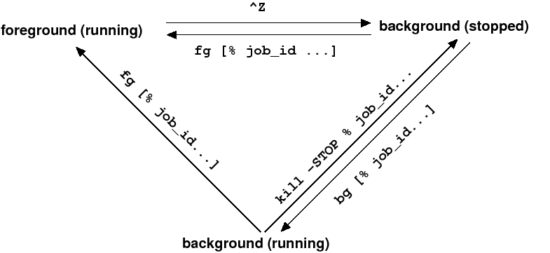

---
tags:
  - linux
  - programming
  - manual
---

# 기본적인 리눅스 개념 및 명령어

## 1 개요 


물론 리눅스에도 GUI가 있긴 하지만, 대부분의 서버에는 GUI가 설치되어 있지 않고 CLI만 존재한다. 즉, 리눅스 서버를 다루고자 한다면 SSH로 쉘에 접속한 다음 텍스트로 된 명령어를 입력하고 그 결과를 텍스트로 받아보는 방식으로 서버를 사용하여야 한다. 이 장에서는 간단한 리눅스 명령어 및 개념(*e.g.* 프로세스, 쉘, 환경변수 등)들을 살펴보면서 기초적인 리눅스 사용법을 설명하고자 한다.


## 2 `man`: 매뉴얼 보기

많은 리눅스 명령어들은 이른바 man page라 불리는 설명서들을 가지고 있으며, 리눅스 상에서 `man` 명령어로 쉽게 확인해볼 수 있다. 리눅스에는 수많은 명령어들이 있고 각각이 수많은 옵션들을 가지므로, 이를 다 가르치거나 외우기가 사실상 불가능 하기 때문에 필요할 때 마다 man page를 확인하거나 구글링을 하는것을 습관으로 해야한다.

```bash
# ssh 명령에 대한 man page 표시
$ man ssh
# man 명령에 대한 man page 표시
$ man man
```

## 3 파일 및 디렉터리

리눅스에는 여러 파일 종류가 있는데 다음과 같다.

- 일반 파일: 윈도우나 맥에서의 파일에 대응된다.
- 디렉터리 파일: 윈도우나 맥에서의 폴더에 대응된다.
- 장치 파일: 장치 드라이버의 인터페이스를 나타낸다. 예를 들어, 오디오
  장치파일에 내용을 저장하면 그것이 소리로 출력된다. 리눅스에서는 거의 모든
  것이 마치 파일처럼 관리되기 때문에 이러한 파일이 존재한다.
- 심볼릭 링크 파일: 다른 파일에 대한 경로(참조)를 포함하는 파일로, 마치 바로가기와
  비슷한 기능을 한다.

다음은 리눅스에서 파일 관리와 관련이 깊은 명령어들이다.

### 3.1 `pwd`: 현재 디렉터리의 경로 표시

```bash
$ pwd
/home/alice
```

### 3.2 `ls`: 디렉터리의 파일 목록 표시

```bash
# /tmp 경로의 파일 목록
$ ls /tmp
emacs1000
# 현재 디렉터리의 파일 목록
$ ls
bar  foo.txt
# -a: 숨김파일도 보여줌; 파일명이 `.`으로 시작하는 경우 숨김파일로 간주한다.
$ ls -a
.  ..  .qux.txt  bar  foo.txt
# -l: 리스트 형식으로 보여줌
$ ls -l
total 4
drwxr-xr-x 2 alice users 4096  3월 25 17:10 bar
-rw-r--r-- 1 alice users    0  3월 25 17:10 foo.txt
# -al: 리스트 형식으로 숨김파일도 보여줌
$ ls -al
total 12
drwxr-xr-x  3 alice users 4096  3월 25 17:12 .
drwx------ 13 alice users 4096  3월 25 17:13 ..
-rw-r--r--  1 alice users    0  3월 25 17:12 .qux.txt
drwxr-xr-x  2 alice users 4096  3월 25 17:10 bar
-rw-r--r--  1 alice users    0  3월 25 17:10 foo.txt
```

리스트 형식으로 파일을 보는 경우, 빈 칸으로 구분해보면 총 7개의 필드가 있는 것을 확인할 수 있는데 순서대로 (1) 타입 및 권한 (2) 링크 개수 (3) 파일 소유자 (4) 소유 그룹명 (5) 파일 크기 (6) 최종 수정 시간 (7) 파일 이름을 나타낸다.

타입 및 권한은 10개 문자로 표시되는데, 1개 / 3개 / 3개 / 3개로 끊어서 읽는다. 읽는 규칙은 다음과 같다:

- 첫 문자는 파일의 종류를 표시한다. `-`: 일반 파일, `d`: 디렉터리, `l`: 심볼릭
  링크.
- 그 외: 각각 파일 소유자, 그룹 소속원, 그 외 사용자에 대한 파일 권한을
  나타낸다. `r`: 읽기 권한, `w`: 쓰기 권한, `x`: 실행 권한, `-`: 권한 없음.
- 예를 들어
  - `-rw-r--r--`: 일반 파일이며, 소유자는 읽기/쓰기 권한이 있지만 그룹
    소속원이나 그 외 사용자는 읽기 권한만 가진다.
  - `drwxr-x---`: 디렉토리이며, 소유자는 모든 권한을 가지지만 그룹 소속원은
    읽기/실행 권한만 가지고, 그 외 사용자는 아무런 권한이 없다.

### 3.3 `chmod`: 파일의 권한 변경

```bash
# foo.txt 파일 소유자(u)와 그룹(g)에 실행 권한(x) 추가(+).
$ chmod ug+x foo.txt
# 그 외 사용자(o)에 모든 읽기/쓰기 권한(rw) 제거 (-).
$ chmod o-rw foo.txt
# 모든 사용자(a)에 실행 권한 추가.
$ chmod a+x foo.txt
# 권한을 rwxr-xr-x로 변경; rwx <-> 0b111 <-> 7, r-x <-> 0b101 <-> 5.
$ chmod 755 foo.txt
```

### 3.4 `mkdir`: 디렉터리 생성

```bash
$ mkdir /tmp/foo
$ ls /tmp
emacs1000  foo
$ mkdir foo
$ ls
bar  foo  foo.txt
```

### 3.5 `ln`: 링크 생성

```bash
# -s: 심볼릭 링크
$ ln -s /tmp qux
$ ls /tmp
emacs1000  foo
# qux는 /tmp 경로에 대한 바로가기처럼 작동함
$ ls qux
emacs1000  foo
```

### 3.6 `cd`: 다른 디렉터리로 이동

```bash
# /tmp 디렉터리로 이동
$ cd /tmp
$ pwd
/tmp
$ cd foo
$ pwd
/tmp/foo
# 상위 디렉터리로 이동
$ cd ..
$ pwd
/tmp
# 홈 디렉터리로 이동
$ cd
$ pwd
/home/alice
```

### 3.7 `cp`: 파일이나 디렉터리를 복사

```bash
$ cp /etc/hosts .
$ ls
bar  foo  foo.txt  hosts  qux
$ cp hosts hosts.txt
$ ls
bar  foo  foo.txt  hosts  hosts.txt  qux
# -r: 디렉터리 복사시 하위 디렉터리를 포함하는 모든 파일들도 같이 복사
$ cp -r bar quux
$ ls
bar  foo  foo.txt  hosts  hosts.txt  quux  qux
```

### 3.8 `mv`: 파일이나 디렉터리를 이동하거나 이름을 변경

```bash
$ ls
bar  foo  foo.txt  hosts  hosts.txt  quux  qux
$ ls quux
tmp.txt
$ mv hosts.txt quux/foo.txt
$ ls
bar  foo  foo.txt  hosts  quux  qux
$ ls quux
tmp.txt  hosts.txt
$ mv quux quuux
$ ls
bar  foo  foo.txt  hosts  quuux  qux
$ ls quuux
tmp.txt hosts.txt
```

### 3.9 `rm`: 파일이나 디렉터리를 삭제

```bash
$ rm bar/tmp.txt
# -r: 하위 디렉터리의 내용도 모두 삭제
$ rm -r quuux
# -f: 경고메세지 없이 바로 삭제
$ rm -f hosts
# 현재 디렉터리의 *모든* 파일을 바로 삭제. 조심해서 사용.
$ rm -rf .
# 시스템의 *모든* 파일을 바로 삭제. 따라하면 큰일남.
$ rm -rf /*
```

## 4 입력 및 출력

GUI 환경에서는 다양한 방식의 입력장치(e.g. 키보드, 마우스, 마이크, ...) 및 다양한 출력 장치(e.g. 모니터, 스피커, ...)가 있지만, CLI 환경에서는 텍스트 입력과 텍스트 출력이 유일한 입출력 장치이다. 쉘 환경에 부착된 이러한 텍스트 입출력 장치를 표준스트림이라 부른다. 표준스트림에는 총 세 가지 종류가 있는데 표준 입력(STDIN), 표준 출력(STDOUT), 표준 오류(STDERR)가 그것이다. 앞으로 입력이나 출력이 언급되는 경우는 모두 이러한 표준스트림에서의 입력이나 출력을 의미한다.

우리에게 의미 있는 프로그램들은 대개 사용자들로부터 무언가를 입력 받아 처리하여 출력하는 프로그램들이다. 그러한 프로그램들을 다루기 위해서는 입출력을 적절히 원하는대로 처리할 수 있어야 할 것이다. 다음 명령어들은 표준 입출력과 관련이 있는 간단한 리눅스 명령어들이다.

### 4.1 `echo`: 텍스트 또는 시스템 환경변수를 출력

```bash
$ echo student
student
$ echo I am a student
I am a student
$ echo HOME
HOME
# $: 환경변수 출력. 환경변수에 대한 설명은 쉘 스크립트 부분에서 자세히.
$ echo $HOME
/home/alice
# '': strong quote; 있는 그대로 출력.
$ echo '$HOME'
$HOME
```

### 4.2 `cat`: 파일의 내용을 출력

```bash
$ cat /etc/environment
PATH="/usr/local/sbin:/usr/local/bin:/usr/sbin:/usr/bin:/sbin:/bin:/usr/games:/usr/local/games"
# 여러 텍스트를 한번에 출력할수도 있음
$ cat /etc/environment /etc/lsb-release
PATH="/usr/local/sbin:/usr/local/bin:/usr/sbin:/usr/bin:/sbin:/bin:/usr/games:/usr/local/games"
DISTRIB_ID=Ubuntu
DISTRIB_RELEASE=16.04
DISTRIB_CODENAME=xenial
DISTRIB_DESCRIPTION="Ubuntu 16.04.4 LTS"
# -n: 라인 번호 출력
$ cat -n /etc/environment /etc/lsb-release
     1  PATH="/usr/local/sbin:/usr/local/bin:/usr/sbin:/usr/bin:/sbin:/bin:/usr/games:/usr/local/games"
     2  DISTRIB_ID=Ubuntu
     3  DISTRIB_RELEASE=16.04
     4  DISTRIB_CODENAME=xenial
     5  DISTRIB_DESCRIPTION="Ubuntu 16.04.4 LTS"
```

### 4.3 `more`, `less`: 파일의 내용을 페이지 단위로 출력

```bash
$ more /etc/locale.gen
$ less /etc/locale.gen
```
`less`가 `more`보다 기능이 좀 더 많다. 자세한 것은 man page 참고.

### 4.4 `head`, `tail`: 파일의 처음/마지막 부분을 일부 출력

```bash
$ head /etc/locale.gen
# -n: 출력 줄 수를 지정
$ head -n 5 /etc/locale.gen
$ tail /etc/locale.gen
# -f: 파일에 내용이 추가될 때 따라서 출력. ctrl-c로 종료.
$ tail -f /etc/locale.gen
```

### 4.5 I/O Redirections

- `|`: Pipeline. 왼쪽 명령어의 출력을 바로 오른쪽 명령어의 입력으로 보낸다.

    ```bash
    $ who
    bob      pts/0        2018-02-27 23:14 (192.168.31.41)
    alice    pts/1        2018-03-16 01:20 (tmux(3110).%0)
    dave     pts/2        2018-02-28 14:33 (10.0.59.26)
    craig    pts/3        2018-03-08 03:01 (172.16.53.59)
    $ who | sort
    alice    pts/1        2018-03-16 01:20 (tmux(3110).%0)
    bob      pts/0        2018-02-27 23:14 (192.168.31.41)
    craig    pts/3        2018-03-08 03:01 (172.16.53.59)
    dave     pts/2        2018-02-28 14:33 (10.0.59.26)
    ```

- `>`, `>>`: 명령어의 출력을 파일로 저장한다. 기존 파일이 있는 경우에 작동
  방식이 다른데, `>`는 내용을 덮어쓰고 `>>`는 내용을 추가한다.

    ```bash
    $ echo $HOME > /tmp/foo.txt
    $ cat /tmp/foo.txt
    /home/alice
    $ echo hello > /tmp/foo.txt
    $ cat /tmp/foo.txt
    hello
    $ echo $HOME >> /tmp/foo.txt
    $ cat /tmp/foo.txt
    hello
    /home/alice
    ```

- `<`: 명령어의 입력을 파일에서 불러온다.

    ```bash
    $ cat /etc/lsb-releases
    DISTRIB_ID=Ubuntu
    DISTRIB_RELEASE=16.04
    DISTRIB_CODENAME=xenial
    DISTRIB_DESCRIPTION="Ubuntu 16.04.4 LTS"
    $ sort < /etc/lsb-releases
    DISTRIB_CODENAME=xenial
    DISTRIB_DESCRIPTION="Ubuntu 16.04.4 LTS"
    DISTRIB_ID=Ubuntu
    DISTRIB_RELEASE=16.04
    ```

## 5 파일 및 텍스트 검색

### 5.1 `find`: 주어진 조건에 해당하는 파일들을 검색

```bash
# /etc/ssh와 하위 디렉토리들에서 파일명에 host를 포함하는 경우를 찾기
$ find /etc/ssh -name '*host*'
/etc/ssh/ssh_host_rsa_key
/etc/ssh/ssh_host_rsa_key.pub
/etc/ssh/ssh_host_ecdsa_key
/etc/ssh/ssh_host_ecdsa_key.pub
/etc/ssh/ssh_host_ed25519_key
/etc/ssh/ssh_host_ed25519_key.pub
# 하위 디렉토리를 제외하고 /usr 디렉토리에서 파일명이 bin으로 끝나는 경우를 찾기
$ find /usr -maxdepth 1 -name '*bin'
/usr/bin
/usr/sbin
```

`find`는 수많은 종류의 조건들을 지정할 수 있으며, 또한 단순히 해당되는 파일 경로를 출력하는 것 이외에도 해당하는 파일에 대해 특정 명령을 실행하게 할 수도 있다. 강력한 명령어이므로 자세한 사항은 man page를 확인.

### 5.2 `grep`: 파일 내용에서 주어진 패턴을 포함하는 라인들을 출력

```bash
$ cat /etc/lsb-releases
DISTRIB_ID=Ubuntu
DISTRIB_RELEASE=16.04
DISTRIB_CODENAME=xenial
DISTRIB_DESCRIPTION="Ubuntu 16.04.4 LTS"
# Ubuntu를 포함하는 라인들을 출력
$ grep "Ubuntu" /etc/lsb-releases
DISTRIB_ID=Ubuntu
DISTRIB_DESCRIPTION="Ubuntu 16.04.4 LTS"
# -n: 라인 번호 포함
$ grep -n "Ubuntu" /etc/lsb-releases
1:DISTRIB_ID=Ubuntu
4:DISTRIB_DESCRIPTION="Ubuntu 16.04.4 LTS"
# 표준 입력을 검색할 수도 있음
$ cat /etc/lsb-releases | grep "Ubuntu"
DISTRIB_ID=Ubuntu
DISTRIB_DESCRIPTION="Ubuntu 16.04.4 LTS"
# Ubuntu를 포함하지 않는 라인들을 출력
$ grep -v "Ubuntu" /etc/lsb-releases
DISTRIB_RELEASE=16.04
DISTRIB_CODENAME=xenial
# -i: 대소문자 구분 없이 검색
$ grep -i "uBuNTu" /etc/lsb-releases
DISTRIB_ID=Ubuntu
DISTRIB_DESCRIPTION="Ubuntu 16.04.4 LTS"
```

`grep` 역시 강력한 툴이므로 man page 및 구글링을 통해 자세한 옵션들을 확인.

### 5.3 정규표현식 (Regex, Regexp)

정규표현식은 특정 규칙을 포함하는 문자열을 찾기위한 형식 언어의 하나이다. 프로그래밍 작업을 할 때 필요하다 싶은 거의 모든 문자열 패턴들을 정규표현식으로 작성할 수 있는데, 예를 들어:

- `[a-zA-Z]+`: 임의의 영어 단어를 나타내는 정규표현식.
- `[0-9]+`: 자연수를 나타내는 정규표현식.
- `(https?:\/\/)?([\da-z\.-]+)\.([a-z\.]{2,6})([\/\w \.-]*)*\/?`: 웹페이지의
  URL을 나타내는 정규표현식.
- `([a-z0-9_\.-]+)@([\da-z\.-]+)\.([a-z\.]{2,6})`: 이메일 주소를 나타내는
  정규표현식.
- `(?:(?:25[0-5]|2[0-4][0-9]|[01]?[0-9][0-9]?)\.){3}(?:25[0-5]|2[0-4][0-9]|[01]?[0-9][0-9]?)`:
  IP 주소를 나타내는 정규표현식

실제로 앞서 다룬 `find`나 `grep` 둘 다 정규표현식을 지원하며, 여러 리눅스 명령어나 도구들이 정규표현식을 지원한다. 다만 정확한 문법은 명령어나 도구마다 약간씩 다르므로 주의를 해야한다. 자세한 사용법은 구글링으로 확인.

## 6 프로세스

프로세스는 메모리에 로드되어 실행 중인 프로그램의 인스턴스를 의미한다. 운영체제는 context switching 및 virtual address space을 이용해 프로세스의 실행을 제어하며, 이를 위해 모든 프로세스는 PCB라고 하는 공간에 제어에 필요한 여러 정보들을 저장한다. 일반적으로 PCB에는 프로세스의 ID(PID라 한다), 현재 상태, 스케쥴링 정보 같은 각종 정보들을 저장하고 있다.

PC를 사용할 때 보통 여러 개의 창을 동시에 띄워놓고 작업을 하다 필요 없는 프로그램은 닫곤 하는데, 리눅스에서도 마찬가지로 여러 프로세스을 동시에 돌리거나 필요 없는 프로세스를 종료 할 수 있는 명령어들을 제공한다.

### 6.1 Job Control

대부분의 경우 쉘에서 명령어를 입력하는 것은 그 명령어에 해당되는 프로그램을 새 프로세스로 로딩하여 실행하는 것과 같다. 이 때, foreground job과 background job 두 가지로 구분할 수 있다.

Foreground job으로 실행하면 쉘은 실행된 프로세스가 종료될 때 까지 wait 상태로 들어간다. 실행된 프로세스가 종료되면서 쉘에 exit 신호를 보내면 그 때 쉘은 wait 상태가 풀린다. 따라서, 프로세스가 실행되는 동안은 쉘이 wait 상태로 들어가며 그 동안은 명령어를 입력받지 못하는 상태가 된다.

```bash
# Foreground job
$ sleep 10
# 10초뒤에 명령 프롬프트가 나타남; 프로세스가 종료되기 전까지는 명령어를 입력할 수 없다
$
```

만일 명령어 뒤에 `&`를 붙인다면 background job으로 프로세스를 실행하는데, 이 경우 쉘은 자식 프로세스의 종료를 기다리지 않는다. 즉, 프로세스가 실행되는 동안에도 쉘은 다른 명령어를 입력 받을수 있다.

```bash
# Background job
$ sleep 10 &
[1] 180808
# 바로 명령 프롬프트가 나타남; 프로세스의 종료 여부와 상관없이 명령어를 입력할 수 있다
$ 
# background에서 돌아가던 프로세스가 종료되는 순간에 쉘에 아래와 같은 메세지를 출력한다.
[1]  + 180808 done       sleep 10
```

당연히 foreground에서 background로 혹은 background에서 foreground로 쉽게 전환할 수 있다. 뿐만 아니라 간단한 명령어를 이용해 job들을 일시정지하거나 종료시킬 수도 있다. 이러한 작업 전환은 기본적으로 시그널을 기반으로 하는데, 시그널에 대한 자세한 설명은 잠시 뒤에 다루도록 한다.

```bash
# foreground로 실행
$ sleep 1000
# ctrl-z (Control key + Z) 입력: 실행중인 foreground job을 일시정지
^Z
[1]  + 182183 suspended  sleep 1000
# 쉘에서 관리중인 job들을 표시
$ jobs
[1]  + suspended  sleep 1000
# 일시정지된 1번 job을 background job으로 실행
$ bg %1
[1]  + 182183 continued  sleep 1000
# 실행중인 1번 background job을 일시정지
$ kill -STOP %1
[1]  + 182183 suspended (signal)  sleep 1000
# 일시정지된 1번 job을 foreground job으로 실행
$ fg %1
# ctrl-c 입력: foreground job을 종료
^C
$ sleep 1000 &
[1] 182201
# 실행중인 1번 background job을 종료
$ kill %1
[1]  + 182201 terminated  sleep 1000
```



### 6.2 프로세스 출력

Job control의 경우는 현재 쉘에서 실행되었던 프로그램만 관리할 수 밖에 없다는 단점이 있다. 다른 프로세스를 관리하고자 한다면 먼저 어떤 프로세스가 있는지 등을 확인해야 할텐데 다음 명령어들은 이를 위한 기능들을 제공한다.

- `ps`: 현재 실행중인 프로세스 및 상태를 출력한다. 보통은 `ps -aux`나 `ps -ef`와 같은 옵션을 주어 실행한다.

- `pgrep`: 프로세스의 이름을 검색하여 해당하는 프로세스의 PID를 출력한다.

### 6.3 시그널

시그널은 프로세스간 통신에 쓰이는 일종의 신호로서, exceptional control flow를 제어하기 위한 운영 체제의 기능이다. 리눅스에서 쓰이는 시그널 중 대표적인 것들은 다음과 같다:

- SIGHUP: Terminal line hangup
- SIGINT: Interrupt from keyboard
- SIGQUIT: Quit from keyboard
- SIGKILL: Kill program
- SIGSEGV: Segmentation fault (illegal memory ref)
- SIGTERM: Software termination signal
- SIGCHLD: A child process has stopped or terminated
- SIGCONT: Continue process if stopped
- SIGSTOP: Stop signal not from terminal
- SIGTSTP: Stop signal from terminal

앞서 다뤘던 예제들을 살펴보면:

- ctrl-z: Foreground job에 SIGTSTP를 보낸다.
- `kill -STOP %n`: n번 background job에 SIGSTOP을 보낸다.
- ctrl-c: Foreground job에 SIGINT를 보낸다.
- `kill %n`: n번 background job에 SIGTERM을 보낸다.

프로세스에 시그널을 보내는 위한 쉘 명령어들은 다음이 있다:

- `kill`: 해당 job ID(`%`를 붙인 경우)를 가지는 job 혹은 PID(`%`를 안붙인 경우)를 가지는 프로세스에 해당하는 시그널을 전달한다. 옵션없이 실행되는 경우는 SIGTERM을 보낸다.
- `pkill`: 해당 이름을 가지는 프로세스에 시그널을 전달한다.
- `killall`: 특정 이름을 가지는 모든 프로세스에 시그널을 전달한다.

## 7 쉘 스크립트

스크립트 혹은 스크립트 언어는 프로그래밍 언어의 한 종류로, 기존에 이미 존재하는 프로그램을 제어하기 위한 용도로 쓰이는 언어이다. 리눅스 쉘은 처음 단순히 사용자의 명령을 받아 실행시키는 기능만 있었지만, 이후에 여러 스크립트 기능들이 부가적인 기능들로서 추가되었다.


쉘 스크립트는 기본적으로 텍스트 파일로 작성된다. `sayhello.sh` 파일을 만들어 다음과 같이 작성하자[^linux-1]:


[^linux-1]: 만일 리눅스에서 텍스트 에디터를 쓰는 법을 모른다면 [[vim]]을 먼저 보고 다시 여기로 와도 좋다.
	

```{.bash .numberLines}
#!/bin/bash
date
echo hello world!
```

맨 첫 줄은 `#!`로 시작하고, 그 뒤에 스크립트를 실행할 프로그램의 경로를 적어준다. 이 경우는 `bash` 쉘을 이용한 스크립트를 짤 것이기 때문에 `/bin/bash`를 뒤에 붙인다. 그 다음 줄부터는 실제로 실행할 명령어들을 차례로 적어주면 된다. 이제 쉘에서 실행 권한을 주고 실제로 실행을 해보면 파일에 작성했던 대로 명령어들이 실행되는 것을 확인할 수 있다.

```bash
$ chmod +x sayhello.sh
$ ./sayhello.sh
Thu Mar 29 17:02:55 KST 2018
hello world!
```

`sayhello.sh`는 단순한 명령어들만 실행시키지만, 스크립트 기능들을 이용한다면 단순히 명령어를 실행하는 것보다 더 복잡한 작업들을 수행할 수 있게 된다. 요컨대, for 문을 이용하여 여러 개의 파일에 대해 특정 작업을 하거나, if 문을 활용하여 프로그램의 오류가 발생했을 때 특정한 작업을 하도록 하는 등의 작업들이 가능하다. 물론, 이를 파일에 저장하지 않고 바로 쉘에 한줄 한줄씩 입력하여도 (불편하긴 하지만) 실행이 가능하다.

이러한 스크립팅을 지원하기 위해 쉘은 사용자에게 받은 명령을 먼저 해석한 후 실행하며, 따라서 정확한 쉘 스크립트 기능을 모른다면 우리가 원하는 결과와 다른 결과를 얻을 수도 있다. 다음 예를 보자.

```bash
# 쉘에서 입력받은 인자들을 그대로 출력하는 명령어
$ alias myparse="python -c 'import sys; print(sys.argv[1:])'"
$ myparse hello world
['hello' 'world']
$ myparse {1..3} $(( 1 + 3 )) "$(echo $HOME)"
['1', '2', '3', '4', '/home/alice']
```

분명히 쉘에서 명령어를 작성할 때는 `{1..3}`, `$(( 1 + 3 ))`, `"$(echo $HOME)"`와 같은 인수들을 사용했는데, 실제 명령어의 전달된 인수들은 쉘이 이를 해석하여 다르게 나타난 것을 확인할 수 있다. 만일 `{1..3}`, `$(( 1 + $num ))`, `"$(echo $HOME)"`로 된 인수를 그대로 사용하려는 것이 원래 목적이였다면 특수한 처리를 해주어야 한다.

매뉴얼에는 기초적인 스크립트 작성시 필요한, 그리고 주의해야 할 내용들만 간략히 서술하였다. 스크립트 작성에 관한 자세한 내용은 [mug896]님의 [Bash 쉘 스크립트 가이드]를 참조하라.

### 7.1 주석 (Comment)

Bash에서 `#` 뒤에 붙는 문자열들은 주석으로 처리된다. 단, 모든 `#`가 주석으로 처리되지는 않는데, 다음 두 조건 중 하나에 해당되어야 한다:

- `#`가 맨 앞에 있음
- `#` 바로 앞에 공백문자가 있음

만일 `#`를 주석처리하고 싶지 않다면 escape 혹은 quote를 씌운다. 자세한 설명은 후술.

### 7.2 공백 문자

모든 쉘 명령어들은 공백으로 분리되어 해석된다. 요컨대, 공백으로 분리되지 않은 문자열들은 하나의 명령어나 혹은 하나의 인수로 해석된다. 사소해 보이지만 자주 오류의 원인이 되는데, 다음 예제를 보면서 확인하도록 하자.

```bash
# 정상 실행
$ { echo 1; echo 2 ;}
1
2
# 에러: `{` 키워드와 `echo` 명령을 붙였기 때문에 `{echo`를 명령어로 해석함
$ {echo 1; echo 2 ;}
bash: syntax error near unexpected token '}'

# 대입 명령. 등호 양 옆에 *반드시* 공백이 없어야함
$ foo=42
$ echo $foo
42
# 에러: `foo`를 명령어로, `=42`를 인수로 해석하므로
$ foo =42
foo: command not found
# 에러: `foo=`를 공백대입명령으로, `42`를 명령어로 해석하므로
$ foo= 42
42: command not found
```

### 7.3 Quotes and escaping

앞서 보았듯 쉘에서 공백 문자나 `#` 같이 특수한 기능을 가지는 문자들은 단순한 문자로 처리되지 않는다. 따라서 이러한 문자들을 단순한 문자로 처리하기 위해서는 quote를 씌우거나 escaping을 해야한다.
```bash
# `#`가 주석으로 처리되어 아무것도 출력하지 않음
$ echo #
# escaping: backslash를 앞에 붙인다.
$ echo \#
#
# weak quoting: 큰 따옴표로 감싼다.
$ echo "#"
#
# strong quoting: 작은 따옴표로 감싼다.
$ echo '#'
#
```

`\`, `'`, `"` 또한 특수한 기능을 가진 문자기에, 단순한 문자로 처리하기 위해서는 이들 또한 quote를 씌우거나 escaping을 해야한다.

```bash
$ echo \"
"
$ echo '"'
"
```

### 7.4 변수

```bash
# 변수 대입: 괄호 양 옆에 공백이 *반드시* 없어야한다.
$ foo="Hello world"
# $: 변수확장; 변수를 참조할 때는 $를 앞에 붙인다
$ echo $foo
Hello world
# $를 생략한 경우
$ echo foo
foo
# $(): 명령치환; 괄호 안의 명령을 실행한 뒤 출력 결과를 참조한다
$ bar=$(whoami)
$ echo $bar
alice
# Weak quotation의 경우, quote 안에 있는 변수확장이나 명령치환을 실행한다.
$ qux="$foo, $bar."
$ echo $qux
Hello world, alice.
# Strong quotation의 경우는 실행하지 않는다.
$ qux='$foo, $bar.'
$ echo $qux
$foo, $bar.
```

### 7.5 환경 변수
현재 쉘 환경과 직접적으로 연관이 되는 변수들을 환경 변수라 하며, 쉘이 생성하거나 참조하는 변수들이다. 이 변수들을 바꾸어 쉘의 작동에 영향을 끼칠 수 있다. 대표적인 환경 변수들은 다음이 있다:

```bash
# USER: 사용자 계정 이름
$ echo $USER
alice
# HOME: 홈 디렉토리 경로
$ echo $HOME
/home/alice
# PWD: 현재 디렉토리 경로
$ echo $PWD
/home/alice
# PATH: 실행할 프로그램의 위치들; PATH 경로에 있는 프로그램은 정확한 경로를 입력할 필요없이 프로그램 이름만으로 실행할 수 있다.
$ echo $PATH
/usr/local/bin:/usr/bin:/bin:/usr/sbin:/sbin
```

## 8 기타

- `wget`: 웹에 있는 파일을 서버로 다운로드한다.
- `htop`: 현재 서버의 CPU, 메모리 사용량 등에 대한 정보를 보여준다.
- `time`: 명령어의 실행 시간을 측정한다.
- `exit`, `logout`: 쉘을 종료한다.
- `ctrl-d`: EOF(End-of-file) 캐릭터. 쉘에서 입력할 경우 쉘을 종료한다.

[mug896]: https://github.com/mug896
[Bash 쉘 스크립트 가이드]: https://mug896.github.io/bash-shell/

[//begin]: # "Autogenerated link references for markdown compatibility"
[vim]: vim.md "텍스트 에디터: Vim"
[//end]: # "Autogenerated link references"