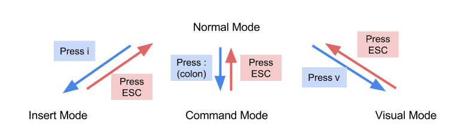

---
tags:
  - programming
  - manual
---

# 텍스트 에디터: Vim

서버 환경에서 코드(혹은 문서)를 작성 및 수정 할 때는 텍스트 에디터를 사용한다. 리눅스에서 널리 쓰이는 텍스트 에디터로는 Vi, Emacs, Nano 등이 있다. Vim은 Vi의 변종판인 `Vi improved`를 지칭하며 여기서는 Vim의 간단한 사용법에 대해 설명한다.

## 1 Vim의 실행

터미널에서 다음과 같이 입력하면 Vim을 실행할 수 있다.
```bash
$ vim
```
일반적으로는 `vi`만 입력해도 alias에 의해 `vim`이 실행된다.

직접 파일을 생성하고자 할 때는
```bash
$ vi filename
```
을 실행하면 된다. 파일이 없는 경우에는 해당 파일명을 갖는 파일이 생성되고, 있는
경우에는 확인 및 수정이 가능하다. 단, vi를 사용할 때는 실제로 확장자명을
명시해야 한다. 가령, 다음과 같이 텍스트 파일 `hello.txt`를 작성할 수 있다.
```bash
$ vi hello.txt
```

## 2 Vim의 주요 모드

위의 방법으로 Vim을 실행하면 갑자기 대부분의 키가 작동하지 않는 상태가 된다.[^vim-1] 이와 같은 현상이 발생하는 이유는 Vim에는 다양한 모드가 있기 때문이다.

[^vim-1]: 두렵다면 Esc 키를 누르고 `:q!` 를 눌러서 Vim을 나갈 수 있다. 그러나 필자는 두려움을 이겨내는 자가 진정으로 용기있는 자라 생각한다.

Vim에는 일반(Normal), 입력(Insert), 비주얼(Visual), 명령어(Command)의 네 가지 주요 모드가 있다. Vim을 처음 실행하면 일반 모드 상태이다. 여기서 i(insert의 줄임)키를 누르면 텍스트를 입력할 수 있는 입력 모드가 된다. Esc 키를 누르면 다시 일반 모드로 돌아간다. 일반 모두에서 v키를 누르면 블럭 등을 지정할 수 있는 비주얼 모드가 된다. Vim 에서는 화면의 제일 밑줄에 -- INSERT --, -- VISUAL -- 와 같이 현재 모드를 알려준다.

일반 모드인 상태에서 :를 누르면 명령어(Command) 모드가 된다. 모드 상태를 보여주던 제일 밑줄에서 :다음에 커서가 놓이면서 명령어를 기다리는 것을 볼 수 있다. 각종 명령어를 사용하여 거의 모든 환경설정과 파일 열기(e; edit)/저장(w; write)과 종료(q; quit) 등의 작업이 가능하고 컴파일 등 외부 쉘 명령까지 실행할 수 있다.



## 3 Vim의 대표적인 키

다음은 Vim에서 주로 사용하게 될 키들이다. 각 제목의 괄호 안은 실행 가능한 모드를 의미한다.

### 3.1 이동 (일반 모드, 비주얼 모드)

코드를 작성할 때 코드의 다른 부분으로 이동하는 것은 매우 필수적인 기능이다. Vim에서는 화살표 모양의 방향키를 이용하는 것 보다 훨씬 세련된 이동 관련 명령어들을 지원한다.

|   Commands   |   Function   |
|--------------|--------------|
| h | 왼쪽 이동 |
| j | 아래로 이동 |
| k | 위로 이동 |
| l | 오른쪽 이동 |
| w | 다음 단어 시작으로 이동 |
| 0 | 행의 시작으로 이동 |
| $ | 행의 끝으로 이동 |
| :`n` | n번째 줄로 이동 |
| gg | 문서 첫 행으로 이동 |
| G | 문서 마지막 행으로 이동 |

이 외에도, Vim에서는 다양한 이동 관련 명령어들을 지원한다. 방향이동과 관련된 키를 보면 알겠지만 과거에는 방향키가 없었기에 키보드 위의 적당한 위치에 방향키를 맵핑하여 사용했다. 물론 최근의 Vim은 마우스 클릭과 방향키 이동을 모두 지원한다. 그러나 실제로 Vim을 사용하다 보면 멀리 떨어져 있는 마우스나방향키에 손을 뻗는 것이 귀찮게 느껴질 것이고 키에 익숙해지기만 한다면 위의 방향키들을 사용하는 것이 훨씬 편하게 느껴질 것이다.

### 3.2 텍스트 삽입 및 추가 (일반 모드)

위에서는 `i`키를 누르면 편집 모드로 들어갈 수 있다고 했지만, 실제로 편집 모드에 들어갈 수 있는 키는 여러가지가 있다. 이들은 모두 그 기능이 다르다.

|   Commands   |   Function   |
|--------------|--------------|
| i | 커서 앞에 추가 |
| a | 커서 뒤에 추가 |
| s | 한 글자 삭제하고 삽입모드 시작 |
| o | 현재 행 아래에 새 행 추가 |
| O | 현재 행 위에 새 행 추가 |
| Esc | (입력 모드에서) 일반 모드로 진입 |

### 3.3 편집 (일반 모드, 비주얼 모드)

편집 관련 명령어들은 코드를 작성할 때 가장 요긴하게 쓰일 모드일 것이다. 옛 말에 이런 말도 있지 않은가

> 복붙은 인간의 가장 위대한 발명품이다.

그러나 안타깝게도, Vim의 복붙은 윈도우나 맥의 그것과는 사뭇 다르다. Vim에서 복붙을 비롯한 여러 명령어들은 다음과 같다.

|   Commands   |   Function   |
|--------------|--------------|
| r | 한 글자 바꾸기 |
| u | 실행 취소(undo) |
| Ctrl + r | 다시 실행(redo) |
| y | 선택 영역 복사(yank) |
| yy | 행 복사 |
| p | 커서 뒤에 붙여넣기(paste) |
| P | 커서 앞에 붙여넣기 |
| dd | 행 잘라내기 |
| x | (선택 영역) 잘라내기 |
| d(motion) | (선택 영역) Motion 잘라내기 |
| dd | 행 잘라내기 |

편집 관련 키들은 Vim의 꽃이라고 할 수 있는 **함수형 명령**을 지원한다. 이는 여러 개의 명령어를 입력했을 때, 합성함수처럼 기능을 사용할 수 있음을 의미한다. 대표적으로 `n + commands`가 있는데, 이는 해당 명령을 $n$번 반복하는 것으로 해석된다. 예를 들어 `5dd`는 `dd를 다섯 번 반복`, 즉, 5개의 행을 잘라내라는 명령이 된다. 비슷하게 `5dk`는 k가 위로, d가 motion을 input으로 받아 해당 부분을 잘라내는 명령을 의미하므로, `위로 5개의 행을 잘라내라`는 명령이 된다. Vim에서는 이와 같은 특징을 이용해 숫자와 방향키를 이용하여 문서 내를 자유자재로 돌아다니거나 빠른 속도로 코드를 편집할 수 있다.

### 3.4 텍스트 선택 (비주얼 모드)

비주얼 모드는 선택 모드라고도 불리운다. 이는 비주얼 모드가 마우스의 드래그와 비슷하게 요소들을 블록으로 묶어 편집할 수 있는 기능을 제공하는 모드라 그렇다. 비주얼 모드와 관련된 명령어들은 다음과 같다.

|   Commands   |   Function   |
|--------------|--------------|
| v | 선택 모드 시작 (방향키로 선택) |
| V | 행 단위 선택 모드 시작 (방향키로 선택) |
| Ctrl + v | 블록 단위 선택모드 시작 |
| Esc | 비주얼 모드 종료 |

### 3.5 찾기, 바꾸기 (일반 모드)

윈도우에서는 `Ctrl + f`, 맥에서는 `Cmd + f`로 문서 내의 특정 문자들을 찾을 수 있다. Vim에서는 언뜻 보면 더 난해하지만, 더 세련된 방식의 찾기와 바꾸기 기능을 지원한다.

|   Commands   |   Function   |
|--------------|--------------|
| /pattern | pattern이 나타난 부분 찾기 |
| n | 다음 찾기 |
| N | 이전 찾기 |
| :n,ms/old/new/ | n번째 행부터 m번째 행까지 각 행의 첫 old를 new로 변경 |
| :%s/old/new/g | 문서 내 모든 old를 new로 변경 |
| :%s/old/new/gc | 문서 내 모든 old를 하나씩 확인해가며 new로 변경 |

여기서 마지막 부분의 s는 substitute의 약자이다. `:(start),(end)s/old/new/option`라는 명령어는 `start에서 end까지 old를 new로 option대로 바꾼다`를 뜻한다. 이때 start와 end를 모두 생략하고 %를 입력하면 검색 범위가 문서 전체가 되고, option에는 다음과 같은 명령어들을 입력할 수 있다.

* g : global - 한 줄에 패턴이 여러 번 나오면 모두 바꾼다. 지정하지 않으면 첫번째 패턴만 치환
* i : ignore case - 대소문자 구분을 하지 않는다.
* c : confirm - 검색된 모든 문자열에 대해서 바꿀지 말지를 물어본다.

Vim의 찾기 기능의 특별한 점은 정규표현식을 지원한다는 점인데, 가령 문서 내의 vi 또는 Vi를 모두 지우고 싶을 때는 `:%s/[vV]i//g`를 입력하면 된다! 정규표현식에 대해 더 자세히 공부하고 싶다면 [여기](https://regexone.com/)를 방문하면 된다.

### 3.6 열기, 저장 및 종료 (일반 모드)

문서의 저장, 종료 등과 관련된 명령어는 다음과 같다.

|   Commands   |   Function   |
|--------------|--------------|
| :q | 아무런 변경을 하지 않았을 때 종료하기 |
| :q! | 변경된 내용을 저장하지 않고 강제 종료하기 |
| :w | 변경된 내용을 저장 |
| :wq | 저장하고 종료하기 |
| :wq! | 강제로 저장하고 종료하기 |
| :x | 저장하고 종료하기(=wq) |
| :w `filename` | `filename`으로 파일 저장하기 |
| :e `filename` | `filename` 파일 열기 |

이때 `:x` 의 경우 변동 사항이 없으면 그냥 종료하지만 `:wq`는 항상 저장하고 종료한다는 작은 차이점이 있다. 이 외에도 Vim에는 다양한 명령어들이 있으며 [Vim Cheat Sheet](https://vim.rtorr.com/lang/ko/)에서 확인할 수 있다.

## 4 기타

여기까지 Vim의 간단한(?) 사용법들을 알아보았다. 이 문서를 통해 Vim을 처음 접하는 사람들은 이런 생각을 할 것이다.

> 도대체 내가 왜 이딴 걸 하고 있지?

그러나 Vim이 마냥 불편하고 비효율적이기만 했다면 이렇게 오랜 시간동안 사용될 리는 없었을 것이다. Vim에는 다음과 같은 장점들이 있다.

1. 대부분의 명령어가 키보드 위에 있어, 손가락을 많이 이동하지 않고 작업을 진행할 수 있다.
2. `.vimrc`파일을 이용해 쉽게 커스터마이징할 수 있다.
3. 오랜 시간동안 개발된 수많은 플러그인들이 있다. (자동완성 등)
4. 무엇보다도, **어떤 Unix(Mac 등)나 Linux 시스템에도 vi는 기본적으로 설치되어 있다**. 즉, 많은 환경에서 별다른 환경설정 없이 편집을 진행할 수 있다!

끝으로, 실제로 Vim을 공부하려 한다면 위의 문서들을 일일히 읽고 있는 것 보다는 직접 연습을 하며 익혀보는 것을 강력하게 추천한다. 터미널에 다음을 입력하여 vim의 tutorial을 실행할 수 있다.

```bash
$ vimtutor
```
